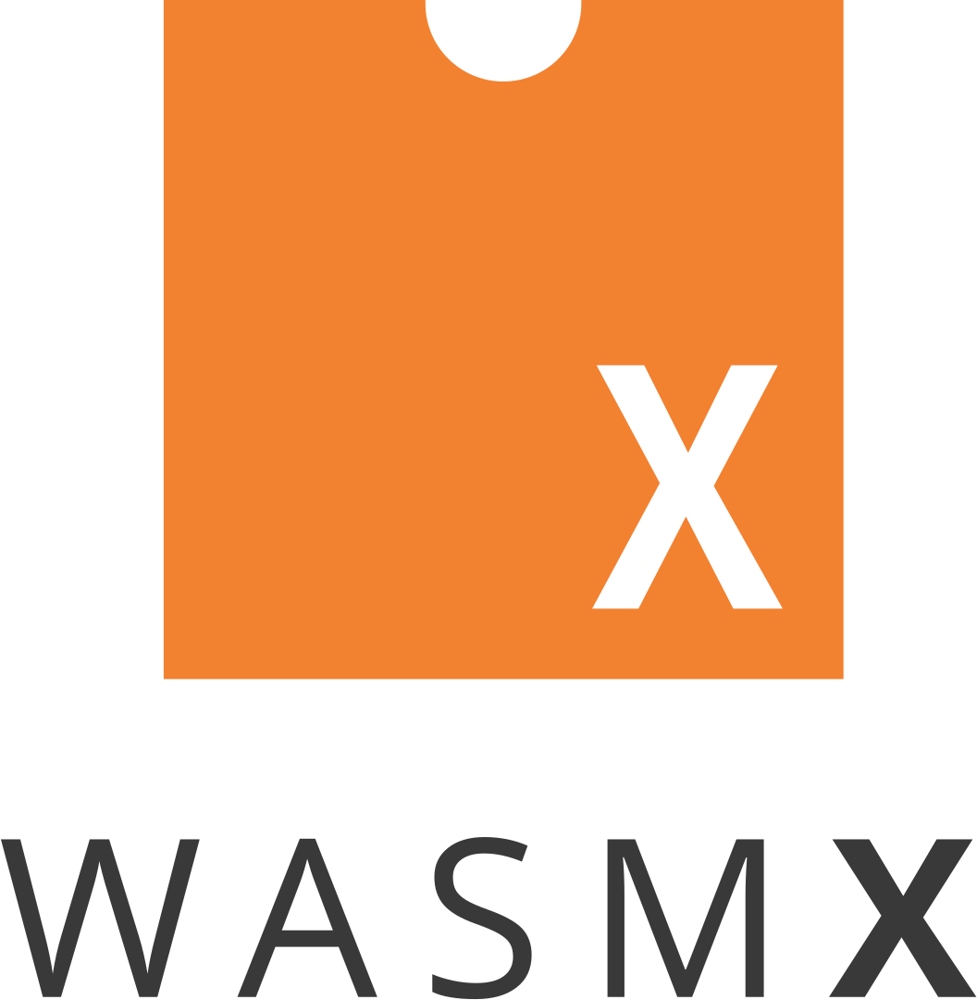

<p align="center">
  
</p>

# WasmX/ngx_wasm_module

> Nginx + WebAssembly

This module enables the embedding of [WebAssembly](https://webassembly.org/)
runtimes inside of [Nginx](https://nginx.org/) and aims at offering several host
SDK abstractions for the purpose of extending and/or introspecting the Nginx web
server/proxy runtime.

Currently, the module aims at supporting the
[proxy-wasm](https://github.com/proxy-wasm/spec) host SDK and supports Wasm
filters identical to those running on
[Envoy today](https://www.envoyproxy.io/docs/envoy/latest/configuration/http/http_filters/wasm_filter.html).

## Table of Contents

- [Synopsys](#synopsys)
- [Examples](#examples)
- [Install](#install)
- [Documentation](#documentation)
- [What is WasmX?](#what-is-wasmx)
- [Roadmap](#roadmap)
- [Getting involved](#getting-involved)
- [License](#license)

## Synopsis

```nginx
# nginx.conf
events {}

# nginx master process gets a default 'main' VM
# a new top-level configuration block receives all configuration for this main VM
wasm {
    #      [name]    [path.{wasm,wat}]
    module my_filter /path/to/filter.wasm;
    module my_module /path/to/module.wasm;
}

# each nginx worker process is able to instantiate wasm modules in its subsystems
http {
    server {
        listen 9000;

        location / {
            # execute a proxy-wasm filter when proxying
            #           [module]
            proxy_wasm  my_filter;

            # execute more webassembly during the access phase
            #           [phase] [module]  [function]
            wasm_call   access  my_module check_something;

            proxy_pass  ...;
        }
    }
}
```

[Back to TOC](#table-of-contents)

## Examples

The
[proxy-wasm-rust-filter-echo](https://github.com/wasmx-proxy/proxy-wasm-rust-filter-echo/)
project showcases the currently available proxy-wasm SDK capabilities of
ngx_wasm_module and is naturally compatible with the Envoy runtime.

More examples are available for each proxy-wasm SDK:

- [AssemblyScript
  examples](https://github.com/solo-io/proxy-runtime/tree/master/examples)
- [C++
  examples](https://github.com/proxy-wasm/proxy-wasm-cpp-sdk/tree/master/example)
- [Go (TinyGo)
  examples](https://github.com/tetratelabs/proxy-wasm-go-sdk/tree/main/examples)
- [Rust
  examples](https://github.com/proxy-wasm/proxy-wasm-rust-sdk/tree/master/examples)
- [Zig
  examples](https://github.com/mathetake/proxy-wasm-zig-sdk/tree/main/example)

Note that all of the above examples may not yet be compatible with
ngx_wasm_module.

Last but not least, the [WebAssembly
Hub](https://www.webassemblyhub.io/repositories/) contains many other proxy-wasm
filters, some of which may not yet be compatible with ngx_wasm_module.

[Back to TOC](#table-of-contents)

## Install

A release is produced from the `main` branch everyday at 6am UTC, referred to as
a "nightly" release; see the [Nightly release
tag](https://github.com/Kong/ngx_wasm_module/releases/tag/nightly) to download
the latest nightly release assets.

Every release produces the following artifacts, for different installation
methods and usage purposes:

- `ngx_wasm_module-$release.tar.gz`: a tarball of the ngx_wasm_module release.
  To be built alongside Nginx at compilation time with `--add-module=` or
  `--add-dynamic-module=`. See [INSTALL.md](INSTALL.md) for instructions and
  examples on how to do so.
- `wasmx-$release-$runtime-$arch-$os.tar.gz`: a pre-compiled binary of Nginx
  built with ngx_wasm_module (i.e. "WasmX") for the specified
  runtime/architecture/OS. Invoke the self-contained `nginx` binary
  appropriately.

[Back to TOC](#table-of-contents)

## Documentation

### proxy-wasm SDK

See
[proxy-wasm/spec/abi-versions/vNEXT](https://github.com/proxy-wasm/spec/tree/master/abi-versions/vNEXT)
for a _mostly_ up-to-date list of functions and their effects.

Also consult the source of the language of your choice in the [proxy-wasm SDKs
list](https://github.com/proxy-wasm/spec#sdks) as this ABI specification is
still evolving and unstable.

### Wasm runtimes

- Wasm C API: https://github.com/WebAssembly/wasm-c-api
- Wasmer C API: https://docs.rs/wasmer-c-api/
- Wasmtime C API: https://docs.wasmtime.dev/c-api/

[Back to TOC](#table-of-contents)

## What is WasmX?

WasmX aims at extending Nginx for the modern Web infrastructure. This includes -
but is not limited to - supporting [CNCF](https://www.cncf.io/) projects &
standards, supporting WebAssembly runtimes (by way of ngx_wasm_module), easing
the contribution learning curve, etc...

While WasmX offers obvious benefits to Kong Inc. today (i.e. embedding
WebAssembly filters inside of Kong Gateway), it could become its own proxy
runtime should it prove itself valuable alongside Envoy, that is: unique in its
own proposition value in terms of performance & footprint compromises.

[Back to TOC](#table-of-contents)

## Roadmap

This project's roadmap is documented via [GitHub
projects](https://github.com/Kong/ngx_wasm_module/projects).

[Back to TOC](#table-of-contents)

## Getting involved

See [CONTRIBUTING.md](CONTRIBUTING.md) to find ways of getting involved.

See [DEVELOPER.md](DEVELOPER.md) for developer resources on building this module
from source and other general development processes.

[Back to TOC](#table-of-contents)

## License

[Pending]

[Back to TOC](#table-of-contents)
