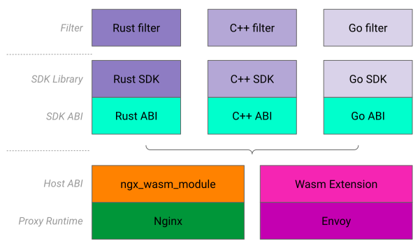
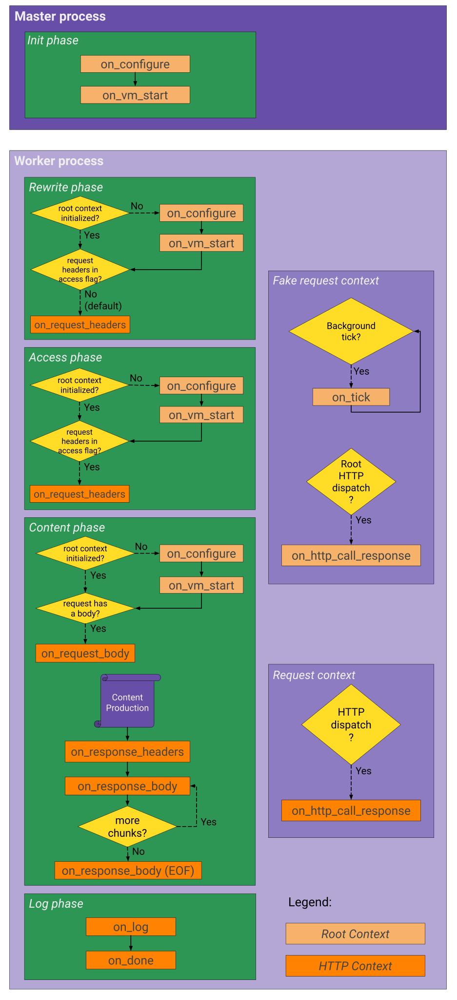

# Proxy-Wasm

## Table of Contents

- [What is Proxy-Wasm?](#what-is-proxy-wasm)
- [Proxy-Wasm in ngx_wasm_module](#proxy-wasm-in-ngx_wasm_module)
    - [Filter Entrypoints]
    - [Filter Chains]
    - [Host ABI Implementation](#host-abi-implementation)
    - [Filters Execution in Nginx](#filters-execution-in-nginx)
    - [Host Properties]
    - [Nginx Properties]
- [Supported Specifications]
    - [Tested SDKs](#tested-sdks)
    - [Supported Entrypoints](#supported-entrypoints)
    - [Supported Host ABI](#supported-host-abi)
    - [Supported Properties](#supported-properties)
- [Examples]
- [Current Limitations]

## What is Proxy-Wasm?

Proxy-Wasm is a set of binary specifications and conventions used to extend
L4/L7 proxies with WebAssembly. These extensions are called "filters".
Originally developed for WebAssembly support in Envoy, the specification ensures
filters are "proxy-agnostic", which allows for a degree of portability of these
extensions between multiple proxy runtimes (e.g. Envoy & Nginx).

Due to sitting in-between the low-level proxy runtime and the filter code,
Proxy-Wasm specifications are made of two complementary counterparts: a _host
ABI_ and an _SDK library_. The former exposes low-level bits of the proxy to the
latter, which is a Proxy-Wasm SDK library used to write the filters. There
exists one Proxy-Wasm SDK library for each supported language. All filters are
built atop the SDK library's abstractions, themselves powered by the ABI and the
underlying runtime.

<p align="center">
  <br />
  
  <p align="center"><b>Fig.1 - Proxy-Wasm SDK Structure</b></p>
  <br />
</p>

Presently, the _Proxy-Wasm SDK libraries_ are implemented in 5 languages:

1. [AssemblyScript](https://github.com/solo-io/proxy-runtime/)
2. [C++](https://github.com/proxy-wasm/proxy-wasm-cpp-sdk/)
3. [Go (TinyGo)](https://github.com/tetratelabs/proxy-wasm-go-sdk/)
4. [Rust](https://github.com/proxy-wasm/proxy-wasm-rust-sdk/)

The _Proxy-Wasm host ABI_ is implemented by Envoy and a handful of [other
proxies](https://github.com/proxy-wasm/spec#servers), including ngx_wasm_module.

Other useful Proxy-Wasm resources:

- [SDK specifications](https://github.com/proxy-wasm/spec) - the complete
  Proxy-Wasm (SDK & ABI) specification is hosted and maintained in this GitHub
  repository.
- Also see [Examples] below for comprehensive and complete filters examples.

[Back to TOC](#table-of-contents)

## Proxy-Wasm in ngx_wasm_module

Because of its existing adoption in proxies and its tailored "reverse-gateway"
design, Proxy-Wasm is the prominent way of extending Nginx with WebAssembly in
ngx_wasm_module. WasmX itself aims at introducing other innovations in Nginx,
but a large part of ngx_wasm_module is dedicated to its Proxy-Wasm
implementation.

[Back to TOC](#table-of-contents)

### Filter Entrypoints

Each SDK library provides a framework to implement a Proxy-Wasm filter in a
given language. Filters are written by implementing "entrypoints" or "callbacks"
that are hooked into the proxy lifecycle (i.e. `on_request_headers`,
`on_response_body`). These extension points are part of an interface defined by
the Proxy-Wasm specifications and exposed as a framework by the SDK libraries.

The Proxy-Wasm specifications allow for entrypoints within several contexts:

- A **Root context**, representing the filter within the proxy process. This
  context is unique for each filter configured in ngx_wasm_module. It exposes
  the configuration entrypoints `on_vm_start`, `on_configure`, as well as
  `on_tick`.
- An **HTTP context**, representing the filter within a request/response
  lifecycle.  This context is unique for each request traversing the filter, and
  exposes the `on_request_headers`, `on_response_body`, `on_http_call_response`
  and so on entrypoints.
- A **Stream context**, representing the filter within a connection lifecycle in
  one of the L4 protocols. Presently, no support for the stream context is
  provided in ngx_wasm_module.

As an example, let's see what a filter and its contexts would look like if it
were written with the Rust SDK Library (version `0.2.1`):

```rust
// lib.rs
use proxy_wasm::{traits::*, types::*};

struct MyRootContext {};
struct MyHttpContext{};

proxy_wasm::main! {{
    // the wasm instance initial entrypoint
    // ...
    proxy_wasm::set_log_level(LogLevel::Info);
    // create and set the root context for this filter
    proxy_wasm::set_root_context(|_| -> Box<dyn MyRootContext> {
        Box::new(MyRootContext {});
    });
}}

// implement root entrypoints
impl Context for TestRoot;
impl RootContext for TestRoot {
    fn on_configure(&mut self, config_size: usize) -> bool {
        if let Some(config_bytes) = self.get_plugin_configuration() {
            // handle configuration
            // ...
        }

        true // return value - continue
    }

    fn get_type(&self) -> Option<ContextType> {
        Some(ContextType::HttpContext) // return value - causes the SDK to call create_http_context
    }

    fn create_http_context(&self, context_id: u32) -> Option<Box<dyn HttpContext>> {
        Some(Box::new(MyHttpContext {})) // return value - create the HTTP context for this request
    }
}

// implement http entrypoints
impl Context for MyHttpContext;
impl HttpContext for MyHttpContext {
    fn on_http_request_headers(&mut self, nheaders: usize, eof: bool) -> Action {
        // do something when request headers are received
        // ...

        Action::Continue // return value - continue to next filter
    }

    fn on_http_response_headers(&mut self, nheaders: usize, eof: bool) -> Action {
        // do something when response headers are about to be sent
        // ...

        Action::Continue // return value - continue to next filter
    }
}
```
<p align="center">
  <p align="center"><b>Fig.2 - Proxy-Wasm Rust filter example</b></p>
  <br />
</p>

In the above example we have a filter implementing two contexts: the Root and
HTTP contexts. Both contexts are represented by Rust structures which the filter
even instantiates itself, although through the [proxy-wasm-rust-sdk] framework.

These structures can contain members and variables that may need to be stored
through a filter's lifecycle. For more detailed filters examples, see
[Examples].

For an overview of all supported filters entrypoints and their corresponding
Nginx phases, see [Filters execution in Nginx](#filters-execution-in-nginx).

[Back to TOC](#table-of-contents)

### Filter Chains

The Proxy-Wasm specifications are designed so that several filters can be
chained together and execute as a "filter chain" within a Stream or HTTP
context.

In a similar fashion to Envoy proxy extensions, each entrypoint's return value
determines the next processing step in the chain, such as "continue to next
filter", or "pause" (i.e. "yield"). While Envoy extensions support more nuanced
return values, Proxy-Wasm specifications up to `0.2.1` only support `Pause` and
`Continue`.

As an example, see the above **Fig.2** example in which `Action::Continue` is an
enum value in the Rust SDK, and used as a return value to indicate that the
filter chain should continue processing.

Paused filter chains will continue to the next step on a "resume" event (i.e.
on HTTP call response). For an example of external HTTP calls, browse the
[Examples] or even the ngx_wasm_module test filters in
[t/lib](https://github.com/Kong/ngx_wasm_module/tree/main/t/lib).

The Proxy-Wasm filter chain is ultimately embedded in a larger "execution chain"
concept, which is described in the [Execution Chain](README.md#execution-chain)
section of "Essential WasmX Concepts".

[Back to TOC](#table-of-contents)

### Host ABI Implementation

From the point of view of Proxy-Wasm, ngx_wasm_module is what we call a **host
implementation** of the specification. In other words, ngx_wasm_module
implements the Proxy-Wasm Host ABI: a set of functions exposing low-level
features of the proxy (i.e. Nginx) to the Proxy-Wasm SDK libraries.

For example, two so-called "host functions" that a proxy must implement as part
of the Host ABI are:
```
i32 (proxy_result_t) proxy_log(i32 (proxy_log_level_t) log_lvl,
                               i32 (const char*) msg,
                               i32 (size_t) msg_len);

i32 (proxy_result_t) proxy_get_buffer(i32 (proxy_buffer_type_t) buf_type,
                                      i32 (offset_t) offset,
                                      i32 (size_t) max_size,
                                      i32 (const char**) return_buffer_data,
                                      i32 (size_t*) return_buffer_size,
                                      i32 (uint32_t*) return_flags);
```

When the Proxy-Wasm filter is running in ngx_wasm_module and invokes a logging
facility, all SDK libraries forward the call to `proxy_log`, a host C function
implemented by ngx_wasm_module and available for
[import](https://webassembly.github.io/spec/core/syntax/modules.html#imports) to
all Proxy-Wasm filters. In `proxy_log`, ngx_wasm_module invokes the Nginx
logging facilities and the user message appears in Nginx's `error.log` file.

The purpose of `proxy_get_buffer` is for Proxy-Wasm filters to retrieve one of
the available buffers (e.g. request or response payloads). It is invoked by SDK
libraries when a filter calls one of `get_http_request_body`,
`get_http_response_body`, `get_http_call_response_body`, etc... What
ngx_wasm_module does in its implementation of `proxy_get_buffer` is manipulating
the Nginx request structures (i.e. `ngx_chain_t`) to produce a representation of
the requested buffer for the filter.

Both of the above examples are low-level ABI functions powering the abstractions
offered by the Proxy-Wasm SDK libraries. Many other features are powered this
way; below is a complete list elaborating the state of [support for the Host
ABI](#supported-host-abi).

[Back to TOC](#table-of-contents)

### Filters Execution in Nginx

In ngx_wasm_module, the Proxy-Wasm HTTP context is implemented as an
[Nginx HTTP
module](https://nginx.org/en/docs/dev/development_guide.html#Modules):
_ngx_http_wasm_module_.

Because Nginx modules themselves are extensions (i.e. of Nginx), it is valuable
to understand how Proxy-Wasm filters are executed in relation to the underlying
[Nginx
phases](https://nginx.org/en/docs/dev/development_guide.html#http_phases) for
multiple reasons (compatibility with other Nginx modules, yielding I/O
capabilities, etc...).

The diagram depicted below shows the flow of filter chains as they go through
the Nginx phases and in relation to their parent processes. Keep in mind that
other Nginx modules may execute before and after each phase.

<p align="center">
  <br />
  
  <p align="center"><b>Fig.3 - Proxy-Wasm steps in Nginx phases</b></p>
  <br />
</p>

[Back to TOC](#table-of-contents)

### Host Properties

Proxy-Wasm filters can access host, connection, or request contexts variables
via so-called "properties". For example, `request.path`, `response.code`, or
`connection.mtls`. The `[prefix].[name]` notation of a property is referred to
as its "path". See [Supported Properties].

Proxy-Wasm SDK libraries expose the `get_property` and `set_property` APIs,
which expect a property path as an array of strings (e.g. `[prefix, name]`), but
note that in our documentation we refer to paths in their `[prefix].[name]`
format.

All properties' values are strings.

In ngx_wasm_module, Host properties are prefixed with `wasmx` and can be used to
store or retrieve any sort of additional context variable. Host properties are
scoped to a filter's current context, be it Root or HTTP.

For example, setting `wasmx.foo` in `on_configure` means `on_tick` will be able
to read the value of `wasmx.foo`. However, `wasmx.foo` in `on_request_headers`
will be considered unset, since the entrypoint is executed within the HTTP
context.

For example:

```rust
impl RootContext for TestRoot {
    fn on_configure(&mut self, config_size: usize) -> bool {
        // set wasmx.hello = "world"
        self.set_property(vec!["wasmx", "hello"], Some("world".as_bytes()));

        true
    }

    fn on_tick(&mut self) {
        let value = ctx.get_property(vec!["wasmx", "hello"]);
        // wasmx.hello == "world"
        assert!(value == Some("world"));
    }
}

impl HttpContext for MyHttpContext {
    fn on_http_request_headers(&mut self, nheaders: usize, eof: bool) -> Action {
        let value = ctx.get_property(vec!["wasmx", "hello"]);
        // not found in HTTP context
        assert!(value == None);

        // set wasmx.hello = "http"
        self.set_property(vec!["wasmx", "hello"], Some("http".as_bytes()));

        Action::Continue
    }

    fn on_log(&mut self) {
        let value = ctx.get_property(vec!["wasmx", "hello"]);
        // wasmx.hello == "http"
        assert!(value == Some("http"));
    }
}
```
<p align="center">
  <p align="center"><b>Fig.4 - Proxy-Wasm Host properties example</b></p>
  <br />
</p>

[Back to TOC](#table-of-contents)

### Nginx Properties

Proxy-Wasm filters can access host, connection, or request contexts variables
via so-called "properties". For example, `request.path`, `response.code`, or
`connection.mtls`. The `[prefix].[name]` notation of a property is referred to
as its "path". See [Supported Properties].

Proxy-Wasm SDK libraries expose the `get_property` and `set_property` APIs,
which expect a property path as an array of strings (e.g. `[prefix, name]`), but
note that in our documentation we refer to paths in their `[prefix].[name]`
format.

All properties' values are strings.

In ngx_wasm_module, it is also possible to retrieve and manipulate [Nginx
Variables] via Proxy-Wasm properties by using the `ngx` prefix. The path
notation to access an Nginx variable is `[ngx, VAR]` (or `ngx.VAR` in dotted
notation). Note that very few Nginx variables can actually be written to.
Calling `set_property` on an immutable Nginx variable will result in a trap.

For example:
```rust
impl HttpContext for MyHttpContext {
    fn on_log(&mut self) {
        // get the $hostname Nginx variable
        let value = ctx.get_property(vec!["ngx", "hostname"]);
        assert!(value == Some("host.com"));

        // get the $pid Nginx variable
        let value = ctx.get_property(vec!["ngx", "pid"]);
        assert!(value == Some("1234"));
    }
}
```
<p align="center">
  <p align="center"><b>Fig.5 - Proxy-Wasm Nginx properties example</b></p>
  <br />
</p>

[Back to TOC](#table-of-contents)

## Supported Specifications

This section describes the current state of support for the Proxy-Wasm
specifications and different SDK libraries:

- [Tested SDKs](#tested-sdks)
- [Supported Entrypoints](#supported-entrypoints)
- [Supported Host ABI](#supported-host-abi)

[Back to TOC](#table-of-contents)

### Tested SDKs

Presently, ngx_wasm_module is tested with the following SDK versions:

- [proxy-wasm-rust-sdk](https://github.com/proxy-wasm/proxy-wasm-rust-sdk)
    - `0.1.0` :heavy_check_mark:
    - `0.2.1` :heavy_check_mark:
- [proxy-wasm-go-sdk](https://github.com/tetratelabs/proxy-wasm-go-sdk)
    - `0.21.0` :heavy_check_mark:

More SDKs and more SDK versions are to be added to ngx_wasm_module's CI
environment.

[Back to TOC](#table-of-contents)

### Supported Entrypoints

Proxy-Wasm filters are written atop an [SDK
ABI](https://github.com/proxy-wasm/spec) which is itself a versioned component
of the Proxy-Wasm specifications.

Presently, ngx_wasm_module supports the following SDK ABI versions:

* `0.1.0` :heavy_check_mark:
* `0.2.0` :heavy_check_mark:
* `0.2.1` :heavy_check_mark:

All filters compiled with Proxy-Wasm SDK libraries implementing these ABI
versions will be compatible with ngx_wasm_module.

Most extension points (i.e. "callbacks" or "handlers") that can be implemented
in filters are available in all ABI versions with rare exceptions as the
specifications are still evolving.

The following table lists all such Proxy-Wasm filters extension points (as of
SDK ABI `0.2.1`) and their present status in ngx_wasm_module:

**Name**                           |  **Supported**      |  **Comment**
----------------------------------:|:-------------------:|:--------------
*Root contexts*                    |                     |
`proxy_wasm::main!`                | :heavy_check_mark:  | Allocate the root context.
`on_vm_start`                      | :heavy_check_mark:  | VM configuration handler.
`on_configure`                     | :heavy_check_mark:  | Filter configuration handler.
`on_tick`                          | :heavy_check_mark:  | Background tick handler.
*Stream (L4) contexts*             |                     |
`on_new_connection`                | :x:                 | *NYI*.
`on_downstream_data`               | :x:                 | *NYI*.
`on_upstream_data`                 | :x:                 | *NYI*.
`on_upstream_close`                | :x:                 | *NYI*.
`on_downstream_close`              | :x:                 | *NYI*.
`on_log`                           | :x:                 | *NYI*.
`on_done`                          | :x:                 | *NYI*.
*HTTP contexts*                    |                     |
`on_http_request_headers`          | :heavy_check_mark:  | Client request headers handler.
`on_http_request_body`             | :heavy_check_mark:  | Client request body handler.
`on_http_request_trailers`         | :x:                 | *NYI*. Client request trailers handler.
`on_http_request_metadata`         | :x:                 | *NYI*. Client HTTP/2 METADATA frame handler.
`on_http_response_headers`         | :heavy_check_mark:  | Response headers handler.
`on_http_response_body`            | :heavy_check_mark:  | Response body handler.
`on_http_response_trailers`        | :x:                 | *NYI*. Response trailers handler.
`on_http_response_metadata`        | :x:                 | *NYI*. Upstream HTTP/2 METADATA frame handler.
`on_http_call_response`            | :heavy_check_mark:  | Dispatch HTTP call response handler.
`on_grpc_call_initial_metadata`    | :x:                 | Dispatch gRPC call response, initial metadata handler.
`on_grpc_call_message`             | :x:                 | *NYI*.
`on_grpc_call_trailing_metadata`   | :x:                 | *NYI*.
`on_grpc_call_close`               | :x:                 | *NYI*.
`on_log`                           | :heavy_check_mark:  | HTTP context log handler.
`on_done`                          | :heavy_check_mark:  | HTTP context done handler.
*Shared memory queues*             |                     |
`on_queue_ready`                   | :x:                 | *NYI*

"*NYI*" stands for "Not Yet Implemented".

[Back to TOC](#table-of-contents)

### Supported Host ABI

Proxy-Wasm filters are written atop a [Host
ABI](https://github.com/proxy-wasm/spec) which is itself a versioned component
of the Proxy-Wasm specifications.

Presently, ngx_wasm_module supports the following SDK ABI versions:
- `0.1.0` :heavy_check_mark:
- `0.2.0` :heavy_check_mark:
- `0.2.1` :heavy_check_mark:

All filters compiled with Proxy-Wasm SDK libraries compatible with these ABI
versions will be compatible with ngx_wasm_module.

Most extension points (i.e. "callbacks" or "handlers") that can be implemented
in filters are available in all ABI versions, with rare exceptions are the
specifications are still evolving.

The following table lists all such Proxy-Wasm filters extension points (as of
SDK ABI `0.2.1`) and their present status in ngx_wasm_module:

**Name**                              |  **Supported**      |  **Comment**
-------------------------------------:|:-------------------:|:--------------
*Integration*                         |                     |
`proxy_log`                           | :heavy_check_mark:  |
`proxy_get_log_level`                 | :x:                 |
`proxy_get_current_time_nanoseconds`  | :heavy_check_mark:  |
*Context*                             |                     |
`proxy_set_effective_context`         | :heavy_check_mark:  |
`proxy_done`                          | :x:                 |
*Timers*                              |                     |
`proxy_set_tick_period_milliseconds`  | :heavy_check_mark:  |
*Buffers*                             |                     |
`proxy_get_buffer_bytes`              | :heavy_check_mark:  |
`proxy_set_buffer_bytes`              | :heavy_check_mark:  |
*Maps*                                |                     |
`proxy_get_header_map_pairs`          | :heavy_check_mark:  |
`proxy_get_header_map_value`          | :heavy_check_mark:  |
`proxy_set_header_map_pairs`          | :heavy_check_mark:  |
`proxy_add_header_map_pairs`          | :heavy_check_mark:  |
`proxy_replace_header_map_pairs`      | :heavy_check_mark:  |
`proxy_remove_header_map_pairs`       | :heavy_check_mark:  |
*Properties*                          |                     |
`proxy_get_property`                  | :heavy_check_mark:  |
`proxy_set_property`                  | :heavy_check_mark:  |
*Stream*                              |                     |
`proxy_resume_downstream`             | :x:                 |
`proxy_resume_upstream`               | :x:                 |
`proxy_continue_stream`               | :heavy_check_mark:  |
`proxy_close_stream`                  | :x:                 |
*HTTP*                                |                     |
`proxy_continue_request`              | :heavy_check_mark:  |
`proxy_continue_response`             | :x:                 | Yielding not supported in response phases.
`proxy_send_local_response`           | :heavy_check_mark:  |
*HTTP dispatch*                       |                     |
`proxy_http_call`                     | :heavy_check_mark:  |
*gRPC dispatch*                       |                     |
`proxy_grpc_call`                     | :x:                 |
`proxy_grpc_stream`                   | :x:                 |
`proxy_grpc_send`                     | :x:                 |
`proxy_grpc_cancel`                   | :x:                 |
`proxy_grpc_close`                    | :x:                 |
`proxy_get_status`                    | :x:                 | Host function for proxy-wasm-rust-sdk `get_grpc_status`.
*Shared key/value stores*             |                     |
`proxy_get_shared_data`               | :heavy_check_mark:  |
`proxy_set_shared_data`               | :heavy_check_mark:  |
*Shared queues*                       |                     |
`proxy_register_shared_queue`         | :heavy_check_mark:  |
`proxy_dequeue_shared_queue`          | :heavy_check_mark:  |
`proxy_enqueue_shared_queue`          | :heavy_check_mark:  | No automatic eviction mechanism if the queue is full.
`proxy_resolve_shared_queue`          | :x:                 |
*Stats/metrics*                       |                     |
`proxy_define_metric`                 | :x:                 |
`proxy_get_metric`                    | :x:                 |
`proxy_record_metric`                 | :x:                 |
`proxy_increment_metric`              | :x:                 |
*Custom extension points*             |                     |
`proxy_call_foreign_function`         | :x:                 |

[Back to TOC](#table-of-contents)

### Supported Properties

Proxy-Wasm filters can access host, connection, or request contexts variables
via so-called "properties". For example, `request.path`, `response.code`, or
`connection.mtls`. The `[prefix].[name]` notation of a property is referred to
as its "path".

Proxy-Wasm SDK libraries expose the `get_property` and `set_property` APIs,
which expect a property path as an array of strings (e.g. `[prefix, name]`), but
note that in our documentation we refer to paths in their `[prefix].[name]`
format.

All properties' values are strings. Properties whose value carries a boolean
meaning return the strings `"true"` or `"false"`.

This section focuses on [Envoy Attributes], which are not formally documented as
part of the Proxy-Wasm specifications but supported by all existing Proxy-Wasm
host implementations through the properties ABI. In order to ensure portability
of existing Proxy-Wasm Envoy filters, ngx_wasm_module aims at supporting as many
Envoy Attributes as possible.

Besides Envoy Attributes, ngx_wasm_module also supports two other kinds of
properties with the following prefixes:

- `wasmx.*` - **Host properties**, able to retrieve and manipulate WasmX-centric
  variables. See [Host Properties].
- `ngx.*` - **Nginx properties**, able to retrieve and manipulate [Nginx
  Variables]. See [Nginx Properties].

The following table lists all Envoy Attributes (as of Envoy 1.23) and their
implementation state in ngx_wasm_module:

**Property Path**                           | **Read Supported** | **Write Supported** | **Comment**
-------------------------------------------:|:------------------:|:-------------------:|:----------------
*Request properties*                        |                    |
`request.path`                              | :heavy_check_mark: | :x:                 | Maps to [ngx.request_uri](https://nginx.org/en/docs/http/ngx_http_core_module.html#var_request_uri).
`request.url_path`                          | :heavy_check_mark: | :x:                 | Maps to [ngx.uri](https://nginx.org/en/docs/http/ngx_http_core_module.html#uri). 
`request.host`                              | :heavy_check_mark: | :x:                 | Maps to [ngx.hostname](https://nginx.org/en/docs/http/ngx_http_core_module.html#hostname).
`request.scheme`                            | :heavy_check_mark: | :x:                 | Maps to [ngx.scheme](https://nginx.org/en/docs/http/ngx_http_core_module.html#scheme).
`request.method`                            | :heavy_check_mark: | :x:                 | Maps to [ngx.request_method](https://nginx.org/en/docs/http/ngx_http_core_module.html#request_method).
`request.useragent`                         | :heavy_check_mark: | :x:                 | Maps to [ngx.http_user_agent](https://nginx.org/en/docs/http/ngx_http_core_module.html#http_user_agent).
`request.protocol`                          | :heavy_check_mark: | :x:                 | Maps to [ngx.server_protocol](https://nginx.org/en/docs/http/ngx_http_core_module.html#server_protocol).
`request.query`                             | :heavy_check_mark: | :heavy_check_mark:  | Maps to [ngx.args](https://nginx.org/en/docs/http/ngx_http_core_module.html#args).
`request.id`                                | :heavy_check_mark: | :x:                 | Returns `x-request-id` header value.
`request.referer`                           | :heavy_check_mark: | :x:                 | Returns `referer` header value.
`request.time`                              | :heavy_check_mark: | :x:                 | Timestamp of the first byte received, with milliseconds as the decimal part.
`request.duration`                          | :heavy_check_mark: | :x:                 | Maps to [ngx.request_time](https://nginx.org/en/docs/http/ngx_http_core_module.html#request_time).
`request.size`                              | :heavy_check_mark: | :x:                 | Maps to [ngx.content_length](https://nginx.org/en/docs/http/ngx_http_core_module.html#content_length).
`request.total_size`                        | :heavy_check_mark: | :x:                 | Maps to [ngx.request_length](https://nginx.org/en/docs/http/ngx_http_core_module.html#request_length).
`request.headers.*`                         | :heavy_check_mark: | :x:                 | Returns the value of any request header, e.g. `request.headers.date`.
*Response properties*                       |                    |
`response.code`                             | :heavy_check_mark: | :x:                 | Maps to [ngx.status](https://nginx.org/en/docs/http/ngx_http_core_module.html#status).
`response.size`                             | :heavy_check_mark: | :x:                 | Maps to [ngx.body_bytes_sent](https://nginx.org/en/docs/http/ngx_http_core_module.html#body_bytes_sent).
`response.total_size`                       | :heavy_check_mark: | :x:                 | Maps to [ngx.bytes_sent](https://nginx.org/en/docs/http/ngx_http_core_module.html#bytes_sent).
`response.grpc_status`                      | :x:                | :x:                 | *NYI*.
`response.trailers`                         | :x:                | :x:                 | *NYI*.
`response.code_details`                     | :x:                | :x:                 | Not supported.
`response.flags`                            | :x:                | :x:                 | Not supported.
`response.headers.*`                        | :heavy_check_mark: | :x:                 | Returns the value of any response header, e.g. `response.headers.date`.
*Upstream properties*                       |                    |
`upstream.address`                          | :heavy_check_mark: | :x:                 | Returns Nginx upstream address if any. This value is retrieved from Nginx's `r->upstream` member, mostly set through [ngx_http_proxy_module].
`upstream.port`                             | :heavy_check_mark: | :x:                 | Returns Nginx upstream port if any. This value is retrieved from Nginx's `r->upstream` member, mostly set through [ngx_http_proxy_module].
`upstream.tls_version`                      | :x:                | :x:                 | *NYI*.
`upstream.subject_local_certificate`        | :x:                | :x:                 | *NYI*.
`upstream.subject_peer_certificate`         | :x:                | :x:                 | *NYI*.
`upstream.dns_san_local_certificate`        | :x:                | :x:                 | *NYI*.
`upstream.dns_san_peer_certificate`         | :x:                | :x:                 | *NYI*.
`upstream.uri_san_local_certificate`        | :x:                | :x:                 | *NYI*.
`upstream.uri_san_peer_certificate`         | :x:                | :x:                 | *NYI*.
`upstream.sha256_peer_certificate_digest`   | :x:                | :x:                 | *NYI*.
`upstream.local_address`                    | :x:                | :x:                 | *NYI*.
`upstream.transport_failure_reason`         | :x:                | :x:                 | *NYI*.
*Connection properties*                     |                    |
`destination.address`                       | :heavy_check_mark: | :x:                 | Maps to [ngx.proxy_protocol_addr](https://nginx.org/en/docs/http/ngx_http_core_module.html#proxy_protocol_addr).
`destination.port`                          | :heavy_check_mark: | :x:                 | Maps to [ngx.proxy_protocol_port](https://nginx.org/en/docs/http/ngx_http_core_module.html#proxy_protocol_port).
`connection.requested_server_name`          | :heavy_check_mark: | :x:                 | Maps to [ngx.ssl_server_name](https://nginx.org/en/docs/http/ngx_http_core_module.html#ssl_server_name).
`connection.tls_version`                    | :heavy_check_mark: | :x:                 | Maps to [ngx.ssl_protocol](https://nginx.org/en/docs/http/ngx_http_core_module.html#ssl_protocol).
`connection.subject_local_certificate`      | :heavy_check_mark: | :x:                 | Maps to [ngx.ssl_client_s_dn](https://nginx.org/en/docs/http/ngx_http_core_module.html#ssl_client_s_dn).
`connection.id`                             | :heavy_check_mark: | :x:                 | Returns downstream connection number, i.e. `r->connection->number`.
`connection.mtls`                           | :heavy_check_mark: | :x:                 | Returns downstream connection mTLS status as a `"true"/"false"` string.
`connection.subject_peer_certificate`       | :x:                | :x:                 | *NYI*.
`connection.dns_san_local_certificate`      | :x:                | :x:                 | *NYI*.
`connection.dns_peer_local_certificate`     | :x:                | :x:                 | *NYI*.
`connection.uri_san_local_certificate`      | :x:                | :x:                 | *NYI*.
`connection.uri_peer_local_certificate`     | :x:                | :x:                 | *NYI*.
`connection.sha256_peer_certificate_digest` | :x:                | :x:                 | *NYI*.
`connection.termination_details`            | :x:                | :x:                 | Not supported.
`source.address`                            | :heavy_check_mark: | :x:                 | Maps to [ngx.remote_addr](https://nginx.org/en/docs/http/ngx_http_core_module.html#remote_addr).
`source.port`                               | :heavy_check_mark: | :x:                 | Maps to [ngx.remote_port](https://nginx.org/en/docs/http/ngx_http_core_module.html#remote_port).
*Proxy-Wasm properties*                     |                    |
`plugin_name`                               | :heavy_check_mark: | :x:                 | Returns current filter name.
`plugin_root_id`                            | :heavy_check_mark: | :x:                 | Returns filter's root context id.
`plugin_vm_id`                              | :x:                | :x:                 | *NYI*.
`node`                                      | :x:                | :x:                 | Not supported.
`cluster_name`                              | :x:                | :x:                 | Not supported.
`cluster_metadata`                          | :x:                | :x:                 | Not supported.
`listener_direction`                        | :x:                | :x:                 | Not supported.
`listener_metadata`                         | :x:                | :x:                 | Not supported.
`route_name`                                | :x:                | :x:                 | Not supported.
`route_metadata`                            | :x:                | :x:                 | Not supported.
`upstream_host_metadata`                    | :x:                | :x:                 | Not supported.

"*NYI*" stands for "Not Yet Implemented".

"Not supported" means the attribute will likely not be supported in
ngx_wasm_module, most likely due to a Host incompatibility.

[Back to TOC](#table-of-contents)

## Examples

- Functional filters written by the WasmX team:
    - [Kong/proxy-wasm-rust-rate-limiting](https://github.com/Kong/proxy-wasm-rust-rate-limiting)
    - [Kong/proxy-wasm-go-rate-limiting](https://github.com/Kong/proxy-wasm-go-rate-limiting)
- Proxy-Wasm SDK examples:
    - [AssemblyScript examples](https://github.com/solo-io/proxy-runtime/tree/master/examples)
    - [C++ examples](https://github.com/proxy-wasm/proxy-wasm-cpp-sdk/tree/master/example)
    - [Go (TinyGo) examples](https://github.com/tetratelabs/proxy-wasm-go-sdk/tree/main/examples)
    - [Rust examples](https://github.com/proxy-wasm/proxy-wasm-rust-sdk/tree/master/examples)

[Back to TOC](#table-of-contents)

## Current Limitations

Besides the state of support for the Proxy-Wasm SDK in ngx_wasm_module, other
factors are at play when porting the SDK to a new Host proxy runtime.

Proxy-Wasm's design was primarily influenced by Envoy concepts and features, but
because Envoy and Nginx differ in underlying implementations there remains a few
limitations on some supported features:

1. Pausing a filter (i.e. `Action::Pause`) can only be done in the following
   steps:
    - `on_http_request_headers`
    - `on_http_request_body`
    - `on_http_call_response`

2. The "queue" shared memory implementation does not implement an automatic
   eviction mechanism when the allocated memory slab is full:
    - `proxy_enqueue_shared_queue`

Future ngx_wasm_module and WasmX work will be aimed at lifting these
limitations and increasing overall surface support for the Proxy-Wasm SDK.

[Back to TOC](#table-of-contents)

[Filter Entrypoints]: #filter-entrypoints
[Filter Chains]: #filter-chains
[Host Properties]: #host-properties
[Nginx Properties]: #nginx-properties
[Supported Specifications]: #supported-specifications
[Supported Properties]: #supported-properties
[Examples]: #examples
[Current Limitations]: #current-limitations

[WebAssembly]: https://webassembly.org/
[Nginx Variables]: https://nginx.org/en/docs/varindex.html
[Envoy Attributes]: https://www.envoyproxy.io/docs/envoy/latest/intro/arch_overview/advanced/attributes.html?highlight=properties#request-attributes
[proxy-wasm-rust-sdk]: https://github.com/proxy-wasm/proxy-wasm-rust-sdk
[ngx_http_proxy_module]: https://nginx.org/en/docs/http/ngx_http_proxy_module.html
